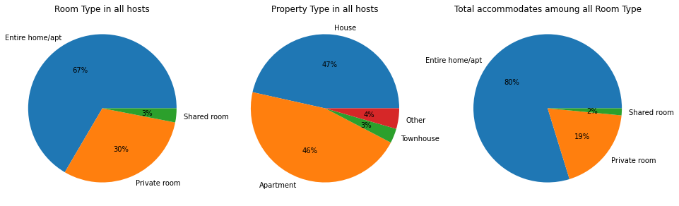
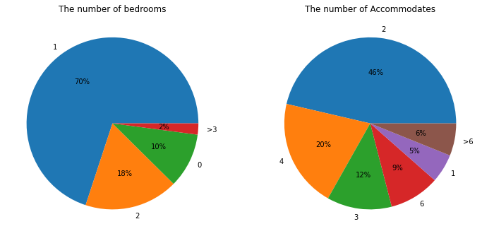

# Seattle AirBNB analysis

[medium link](https://vensonhunt.medium.com/three-things-you-may-dont-know-about-airbnb-4615ee428c60)

# 1. Installation

1. Install Juypterlab first
      + Mac
         - `brew install jupyterlab`
      + Archlinux
        - `sudo pacman -S jupyterlab`
2. install pip for python
      + Archlinux (not recommended to use pip on archlinux)
         - `sudo pacman -S python-pip`(outdated since 2021-01-26)
      + Mac
         - `curl https://bootstrap.pypa.io/get-pip.py -o get-pip.py`

3. install python module
      
      + Archlinux
         - It is prefered to install systemwide module from arch official repository instead of pip)
         - `sudo pacman -S python-pandas python-matplotlib python-seaborn python-scikit-learn`
      + Mac
         - `pip install pandas matplotlib seaborn sklearn`

# 2. Start jupyterlab
   run jupyterlab

  `jupyter-lab`

# 3. Project Motivation
  By go through the Seattle airbnb data, try to find something interesting:
    1. who are the hosts?
    2. who are the guests:
    3. what do the guests care about?
# 4. File Descriptions
   `input/seattle/`
   The dictionary of seattle airbnb open data

   The following Airbnb files are included in this dictionary:

   + listings.csv, including full descriptions and average review score
   + reviews.csv, including unique id for each reviewer and detailed comments
   + calendar.csv, including listing id and the price and availability for that day
# 5. Results
   1. Who are the hosts?
      1. Entire home/apt(67%)
      2. Long term hosts(52%, 300+ days available in a year)
      
   2. Who are the guests?
      1. Affordable price
      2. Couples or couples with children
      
   3. What does the guest care about?
      1. Value, cleanliness, accuracy are the top3 of the review scores
      2. Bungalow
      3. Neighborhood
      4. Smoke allowed and PETS 
    
# 6. Acknowledgement
   This dataset is part of Airbnb Inside, and the original source can be found [here](http://insideairbnb.com/get-the-data.html).  

    
